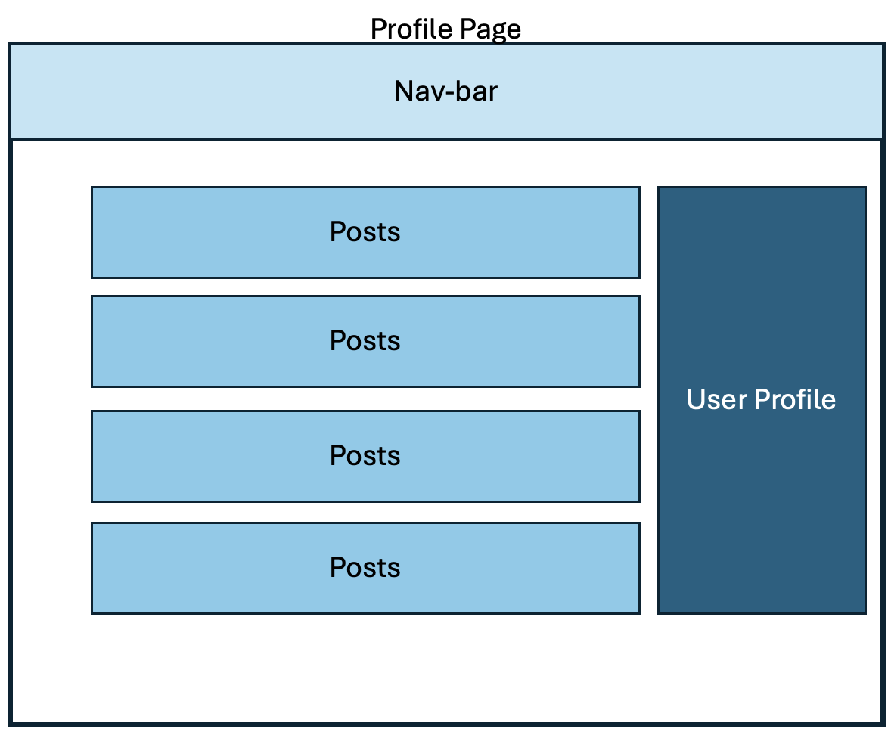

# PORTFOLIO 4 - "News Stories"

News Stories is a social media site where users can create a profile with a secure login and then can make posts about news stories they are interested in. Users can create their own personal profile and follow other users who post content they are interested in. Users can comment on and like news stories, as well as modify or delete their own posts and comments.

The site has a large target audience as the ability to follow other users means everyone can find content they're interested in. The site is simple and easy to use, following a similiar style to social media sites everyone is familiar with making it highly accessible.

Below you can see the site on different screen sizes. Taken from [Am I responsive](https://amiresponsive.co.uk/).

The live site can be found [here](https://sacarr98.github.io/Portfolio_1/) and [here](https://sacarr98-newsstories-3bi4f6u4rp4.ws-eu110.gitpod.io/)

---

## CONTENTS

- [PORTFOLIO 4 - "News Stories"](#portfolio-4---news-stories)
  - [CONTENTS](#contents)
  - [User Experience (UX)](#user-experience-ux)
    - [User Stories](#user-stories)
      - [First Time Visitor Goals](#first-time-visitor-goals)
  - [Design](#design)
    - [Colour Scheme](#colour-scheme)
    - [Typography](#typography)
    - [Imagery](#imagery)
    - [Wireframes](#wireframes)
  - [Features](#features)
    - [General features on each page](#general-features-on-each-page)
    - [Future Implementations](#future-implementations)
    - [Accessibility](#accessibility)
  - [Technologies Used](#technologies-used)
    - [Languages Used](#languages-used)
    - [Frameworks, Libraries \& Programs Used](#frameworks-libraries--programs-used)
  - [Deployment \& Local Development](#deployment--local-development)
    - [Deployment](#deployment)
    - [Local Development](#local-development)
      - [How to Fork](#how-to-fork)
      - [How to Clone](#how-to-clone)
  - [Testing](#testing)
  - [Credits](#credits)
    - [Code Used](#code-used)
    - [Content](#content)
    - [ Media](#media)
    - [ Acknowledgments](#acknowledgments)

---

## User Experience (UX)

### User Stories

#### First Time Visitor Goals

- To easily be able to view news stories of interest
- To be able to quickly set up a personal profile, adding their name, a photo of themselves and links to their other social media
- To be able to follow other users and see other profiles
- To be able to easily navigate between pages

## Design

### Colour Scheme

We wanted to have a colour scheme that was not too bright as users may spend an extended period of time on the site and bright colours can lead to sight fatigue. As the site is primarily about reading news stories we kept the text plain black on a pale background for accessibility and to reduce cognitive overload.

### Typography

Google Fonts was used to import the chosen fonts for this site.

We chose Josefin sans for main headings and Ysabeau SC for everything else. We felt these were complimentary fonts, easy to read and in keeping with the peaceful vibe we wanted the website to have.

### Imagery

The primary imagery used on the site is uploaded by the users themselves, this includes profile pictures the users choose and pictures included to add value to the news stories. The only pre-uploaded imagery is the default profile picture, that is the image given to new users that have not uploaded their own profile picture yet this can be found [here](https://images.yourstory.com/production/document_image/mystoryimage/uploads/production/app_file/content/7869/e10f46dcca)

### Wireframes

## Features

The website comprised of 9 pages, the 'home' page, the 'create news' page, the 'profile list' page, the 'your profile' page, the 'sign-up' page, two 'search' pages, 'edit-post' page, and the 'post-detail' page.

### General features on each page

All pages have the same nav-bar at the top allowing users to easily navigate through the site, this includes a drop-down 'search' tab allowing users to search by username or post content.

The home page features a list of all the posts (just titles and summaries), ordered by the most recent to oldest. Clicking on the open icon takes users to the post-detail page where they can read full news stories. Cliking on the heart icon likes a news story, and clicking on the bin icon allows users to delete news stories they have written. Clicking on the edit icon redirects users to the 'edit-post' page if the user created that post. On the left handside users can write their own news stories, but this is only visible on large screen sizes to avoid the site being too cluttered and difficult to use on smaller screens.

The create news page was designed primarily for smaller screens where they cannot add posts from the home page, it features a simple form where users write a title, summary, and body for their news story. The edit-post page is very similar to the create news page.

The post-detail page was created as having full news stories displayed on the home page would be overwhelming and make it hard for users to find posts they are interested in. The post detail page features the full news story with a a comment section below where users can read other user comments or add their own comments.

The profile list page features all the user profiles with their profile pictures. This allows users to easily browse through profiles to find their friends and follow them or view their posts. Users can also find profiles using the 'search profiles' search bar.

The profile page, is a page for the users profile. It features a list of all the posts they have made (formatted the same as on the home page) and on the left their profile picture, links to their social media pages, a short bio, and a list of who they follow and who follows them. Users can click on the edit profile button and will be redirected to the sign-up form to make changes to their profile.

The sign-up page follows conventions users will be familiar with, and makes use of hover features on text boxes for easy navigation, with pop-up messages when a section needs to be filled.

### Future Implementations

In future I would like users to be able to share other users posts to their profile, if they think stories are of great interest and should reach a larger audience.

### Accessibility

We have actively tried to ensure our website is accessible friendly as possible, we achieved this by:
- Using semantic HTML
- Ensuring sufficient colour contrast throughout the site and using easily readable fonts
- Providing information for screen readers where icons were used in place of text

## Technologies Used

### Languages Used

HTML, CSS, Javascript, Python

### Frameworks, Libraries & Programs Used

Balsamiq - for wireframes
Git - for version control
Github - to save and store files 
Google Fonts - to import all fonts
Font Awesome - for the iconography
Google Dev Tools - to troubleshoot and test features
PostgresSQL - open source database
Bootstrap - for CSS styling
Django - for Python
Heroku - for deployment

## Deployment & Local Development

### Deployment

The site is deployed using GitHub Pages. Visit the deployed site here. To deploy using GitHub pages:

Login or Sign Up to GitHub.
Open the project repository.
Click on "Settings" on the navigation bar under the repository title.
Click on "Pages" in the left hand navigation panel.
Under "Source", choose which branch to deploy. This should be Main for newer repositories (older repositories may still use Master).
Choose which folder to deploy from, usually "/root".
Click "Save", then wait for it to be deployed. It can take some time for the page to be fully deployed.
Your URL will be displayed above "Source".

### Local Development

#### How to Fork

To fork the repository:
- Log in to Github
- Go to the repository for this project 
- Click the Fork button in the top right corner

#### How to Clone

To clone the repository:
- Log in to GitHub
- Go to the repository for this project
- Click on the code button, select whether you would like to clone with HTTPS, SSH or GitHub CLI and copy the link shown.
- Open the terminal in your code editor and change the current working directory to the location you want to use for the cloned directory.
- Type 'git clone' into the terminal and then paste the link you copied in step 3. Press enter.

## Testing

Testing documentation can be found [here](TESTING.md)

## Credits

### Code Used

The code was written by myself with some parts being taken from the blog project - for example the comment form. I also used tutorials found on YouTube by CodeMy.

### Content

The sample posts of news stories were taken from bbc news.

###  Media

<a href="https://images.yourstory.com/production/document_image/mystoryimage/uploads/production/app_file/content/7869/e10f46dcca">Default profile picture</a>

  
###  Acknowledgments

Thanks to the tutors at Code Institute for always being on hand when I needed some help with my code, and to my mentor for their guidence and advice.
