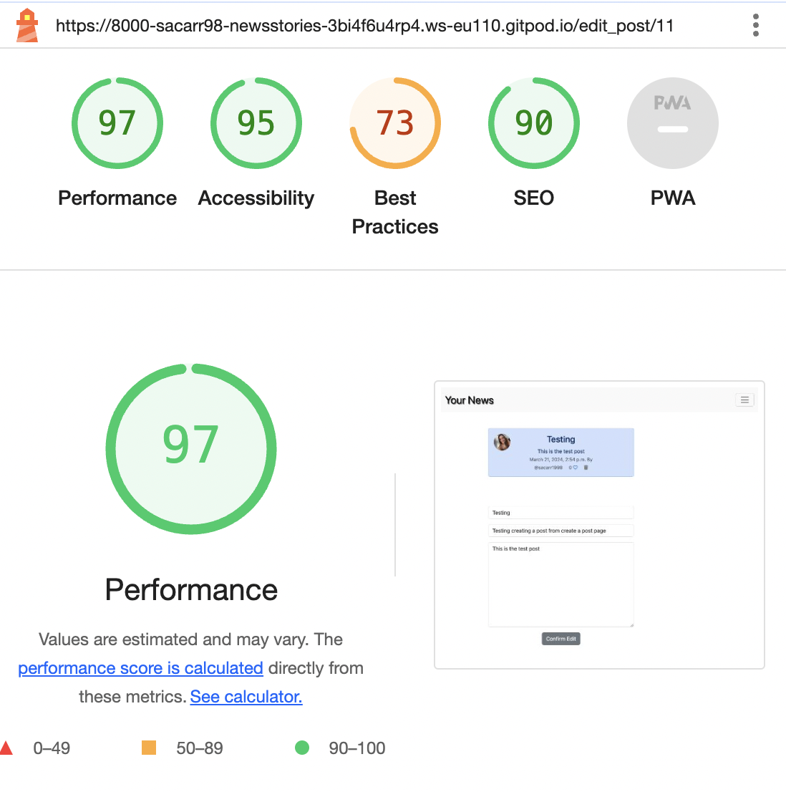
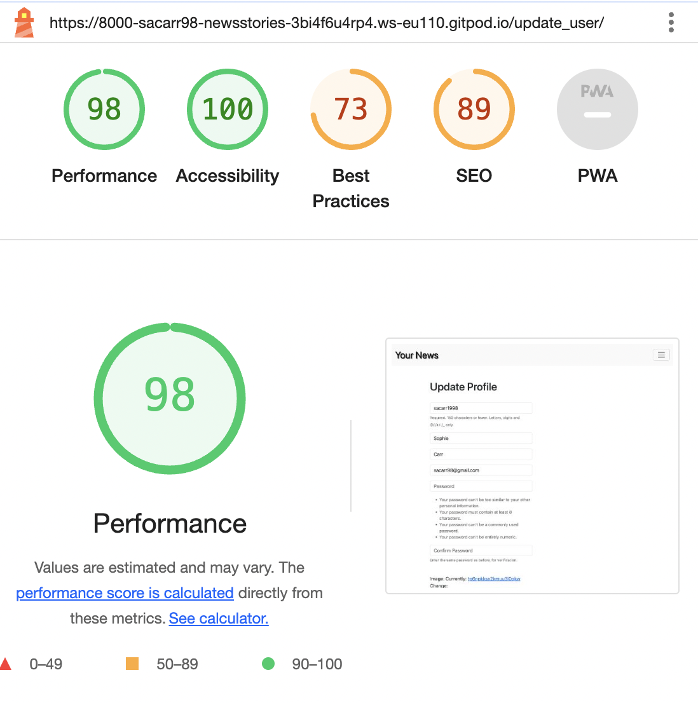

# Your News -  Testing

Visit the deployed site: [Your News](https://sacarr98.github.io/Portfolio_Two/)
- - -

## CONTENTS

- [Your News -  Testing](#your-news----testing)
  - [CONTENTS](#contents)
  - [AUTOMATED TESTING](#automated-testing)
    - [W3C Validator](#w3c-validator)
    - [Lighthouse](#lighthouse)
    - [Results](#results)
  - [MANUAL TESTING](#manual-testing)
    - [Testing User Stories](#testing-user-stories)
    - [Full Testing](#full-testing)
  - [BUGS](#bugs)
    - [Known Bugs](#known-bugs)
    - [Solved Bugs](#solved-bugs)

Testing was ongoing throughout the entire process. Chrome developer tools was used whilst building to find and troubleshoot any issues.

I have analysed each page using google chrome developer tools to ensure the responsiveness of all pages on different screen sizes.

- - -

## AUTOMATED TESTING

### W3C Validator

[W3C](https://validator.w3.org/) was used to validate the HTML on all pages of the website. It was also used to validate the CSS.

* [index.html] - Passed, no errors or warnings to show.
* [signup.html] - Passed, no errors or warnings to show.
* [feedback.html] - Passed, no errors or warnings to show.
* [style.css] - Passed, no errors or warnings to show.

### Lighthouse

I used Lighthouse within the Chrome Developer Tools to test the performance, accessibility, best practices and SEO of the website.

### Results

All pages achieved a minimum of 92 for best practices, and an average of 88 for performance.

### Python Automated Testing

Python testing was used to test all forms used on the site. This can be found in the test_forms.py file.

### Results

All forms passed python testing.

## MANUAL TESTING

### Testing User Stories

All user stories were documented on Github as 'issues' these were allocated to the project 'News Stories' and divided into two iterations. Items were moved from backlog, to in progress, to in review, to done as the project progressed. This helped to ensure that the website met all the requirements set out at the start of the project.

`First Time Visitors`

| Goals | How are they achieved? |
| :--- | :--- |
| I can register an account so that I can follow other users and post. | Users can click 'sign-up' and create an accountt by filling in their username, email, and password. This enables them to write posts and follow other users. |
| I can view a list of posts and select which post I want to view in full. | The home page is displayed to all users prior to log in, here they can view all posts and clicking on the open link opens a page where they can view the post in full. |
| I can use a search bar to find content that interests me. | The site has two search bars in the nav bar, one that can be used to search for key words in posts and another that can be used to search for users.  |

`Returning Visitors`

|  Goals | How are they achieved? |
| :--- | :--- |
| As a logged in user I can create a unique profifle page so other users can see more about me. | Users can click on their profile page and select 'update profile' here they can add a bio, profile picture, and links to their social media accounts. |
| As a logged in user I can leave comments on posts so I can be involved in the conversation. | When a logged in user opens a post they can leave a comment below the post that will be identified as theirs, they can also delete comments they have posted. |
| As a logged in user I can create, update, and delete posts so that I can share news with other users. | A logged in user can write their own posts, they can edit and delete posts they have written by clicking on the edit or delete buttons. |
| As a logged in user I can follow other users so that I can view their posts. | A logged in user can select another user to follow or unfollow and view followed users posts. |

`Frequent Visitors`

| Goals | How are they achieved? |
| :--- | :--- |
| As a frequent user I would like to be able to follow selected posts so that I can keep up to date with the comments | I would like to add functionality that enables users to follow specific posts and they can then view the posts they follow easily if there is a discussion going on in the comments they want to be part of.

### Manual Javascript Testing

| Feature | Expected Outcome | Testing Performed | Result | Pass/Fail |
| --- | --- | --- | --- | --- |
| `display of profile picture` |
|  |  |  |  |  |
| 'if' statement for display of default or custom picture | If user has an uploaded profile picture that should always be displayed, if not the default picture will display. | Uploaded then deleted profile picture. | Expected image loads | Pass |
| `display posts` |
|  |  |  |  |  |
| 'for' loop used to display all user posts in the order they were created. | if a post is made it should appear at the top of the post list, posts displayed should match those in the admin area. | Created a post, and checked posts in admin area. | All posts present and ordered correctly | Pass |
| `profile permissions` |
|  |  |  |  |  |
| 'if' statement used to check post belongs to user. | if a post belongs to the user the user can delete or edit the post | Created a post, and viewed other users posts. | Edit and delete options present on my post only | Pass |

### Full Testing

Full testing was performed on the following devices:

* Laptop:
  * Microsoft surface laptop
* Mobile Devices:
  * iPhone 13 mini

Each device tested the site using the following browsers:

* Google Chrome
* Safari

| Feature | Expected Outcome | Testing Performed | Result | Pass/Fail |
| --- | --- | --- | --- | --- |
| `nav-bar` |
|  |  |  |  |  |
| page links | When clicked the user will be redirected to selected pages. | All links clicked | Expected page loads | Pass |
| `Home Page` |
|  |  |  |  |  |
| Post-detail Link | When clicked the user will be redirected to the post-detail page.| Clicked link | Redirected to the home page. | Pass |
| Edit Link | When clicked the user will be redirected to the edit post.| Clicked link | Redirected to the home page. | Pass |
| Like button | When clicked heart will change colour and like tally will change in accordance. | Clicked button | Post liked | Pass |
| Delete button | When clicked the user will delete their post, and a message will alert the user. | Button clicked | Post deleted, alert recieved |
| `Post-detail Page` |
| | | | | | |
| Comment form submit button | When submit button clicked, comment will be posted and alert message given to user | Comment created and submit button clicked. | Comment posted and alert message recieved (automated testing has been carried out on this form also) | Pass |
| `Edit post Page` |
| | | | | | |
| Submit button | user should be redirected to home page with an alert informing the user the post has been edited | Edited an existing post. | redirected to the home page and an alert message appears | Pass |
| `Profile list Page` |
| | | | | | |
| Profile linke | user should be redirected to relevent profile's page. | Clicked on user profile. | redirected to relevent user page | Pass |
| `Search Page` |
| | | | | | |
| Search bar | typing in the search bar should return results matching search criteria | Searched for relevent word. | matching results appear | Pass |
| Post-detail Link | When clicked the user will be redirected to the post-detail page.| Clicked link | Redirected to the home page. | Pass |
| Edit Link | When clicked the user will be redirected to the edit post.| Clicked link | Redirected to the home page. | Pass |
| Like button | When clicked heart will change colour and like tally will change in accordance. | Clicked button | Post liked | Pass |
| Delete button | When clicked the user will delete their post, and a message will alert the user. | Button clicked | Post deleted, alert recieved |
 - - -

## BUGS

### Known Bugs

| No | Bug | How I solved the issue |
| :--- | :--- | :--- |
| 1 | The initial profile images were not sizing dependent on screen size | made the image sizes fluid  |
| 2 | New users posts were not automatically visible on their profile | Made users automatically follow themselves on creating a profile so they could view their own posts |

### Solved Bugs

| No | Bug | |
| :--- | :--- | :--- |